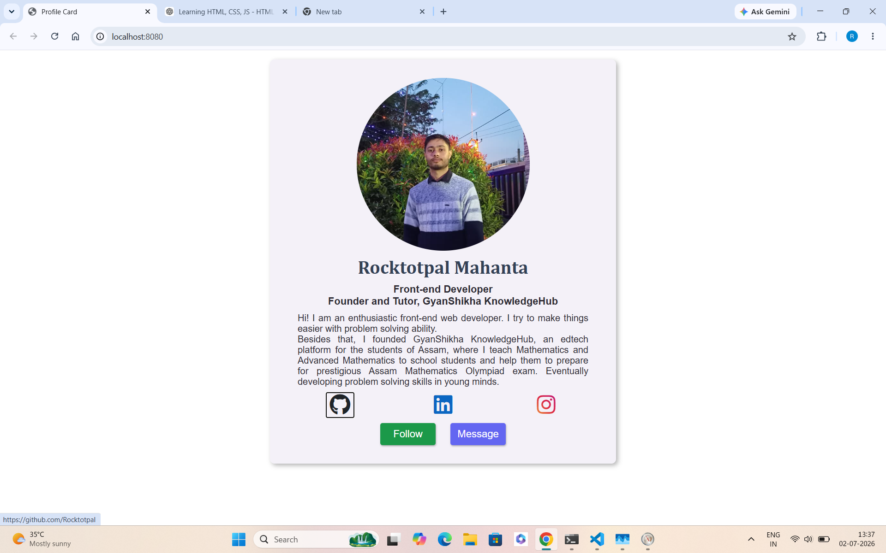

# Professional-profile-card

## Overview

Display a professional profile card that introduces a person, highlight their profession, provide a short biography and offers quick access to their social platforms and contact options.

## Features

- View the profile photo
- Read a short biography
- View professional designation
- Visit GitHub profile
- Visit LinkedIn profile
- Visit Instagram profile
- Follow and Message call-to-action buttons
- Responsive layout for smaller screens

## Technologies Used

- HTML5
- CSS3
- Flexbox
- Media Queries
- Font Awesome

## What I learned

- Planning a project before writing code
- Structuring HTML using semantic elements
- Organizing project folders
- Planning CSS before implementation
- Building responsive layouts using media queries
- Creating reusable CSS classes

## Challenges Faced

- Opening external links securely in a new tab
- Styling Font Awesome icons using brand colors
- Choosing appropriate semantic HTML elements
- Maintaining consistent spacing throughout the layout

## Future Improvements

- Improve accessibility
- Add keyboard navigation
- Improve animations
- Dark mode

## ScreenShot

# Desktop view

# Mobile view

# Live demo

[Live Demo](https://rocktotpal.github.io/profile-card/)

## Folder Structure

profile-card/

│── images/

│── index.html

│── style.css

│── plan.md

│── README.md
